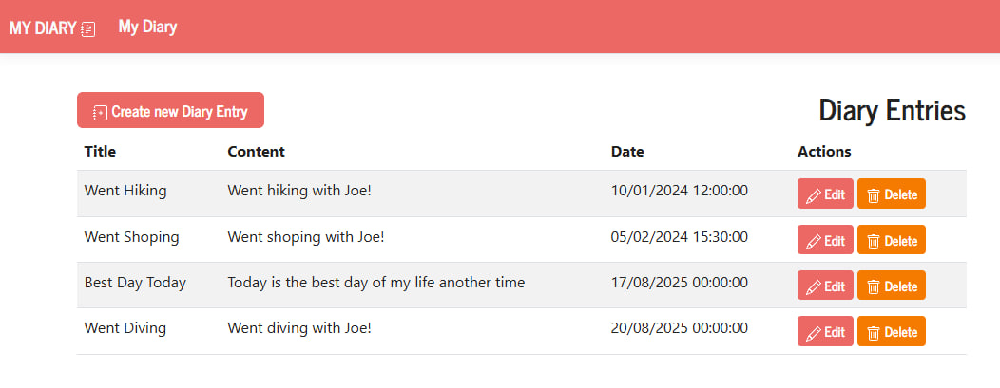
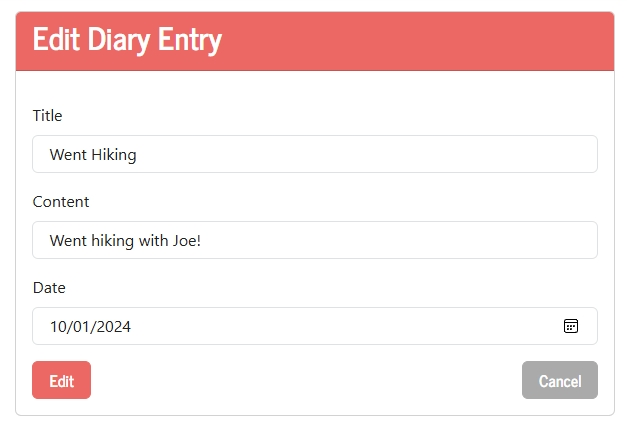

# 📔 Diary App

<p align="center">
  
  
</p>

A simple diary web application built with ASP.NET Core (.NET 9) and Razor Pages. Create, edit, and manage your personal diary entries with a clean, modern interface! ✍️

---

## 🚀 Features

- 📝 Create, edit, and delete diary entries
- 📅 Each entry includes a title, content, and creation date
- 🗂️ List view of all diary entries, sorted by date
- 🎨 Responsive Bootstrap UI
- 🗄️ Data stored in SQL Server using Entity Framework Core
- 🔒 Model validation for entry fields

---

## 🛠️ Tech Stack

- ASP.NET Core (.NET 9)
- Razor Pages
- Entity Framework Core
- SQL Server
- Bootstrap 5

---

## 📦 Getting Started

### Prerequisites

- [.NET 9 SDK](https://dotnet.microsoft.com/download)
- [SQL Server](https://www.microsoft.com/en-us/sql-server/sql-server-downloads)

### Installation

1. **Clone the repository**:  
   ```
   git clone https://github.com/yourusername/DiaryApp.git cd DiaryApp
   ```
3. **Configure the database connection**:  
   Update the `DefaultConnection` string in `appsettings.json` if needed:  
   ```
   "ConnectionStrings": { "DefaultConnection": "Server=YOUR_SERVER;Database=Diary;Trusted_Connection=True;TrustServerCertificate=True;MultipleActiveResultSets=true" }
   ```
5. **Apply migrations and seed data**:  
   ```
   dotnet ef database update
   ```
6. **Run the application**:  
   ```
   dotnet run
   ```
8. Open your browser and navigate to `https://localhost:5001` (or the URL shown in the console).

---

## 🖥️ Usage

- Click **Create new Diary Entry** to add a new entry.
- Use the **Edit** and **Delete** buttons to manage your entries.
- All entries are listed on the main page, sorted by creation date.

---

## 🧑‍💻 Project Structure

- `Controllers/DiaryEntriesController.cs` - Handles CRUD operations for diary entries.
- `Models/DiaryEntry.cs` - Diary entry model with validation.
- `Data/ApplicationDbContext.cs` - Entity Framework Core context and seed data.
- `Views/DiaryEntries/Index.cshtml` - Main diary entries list view.
- `Views/Shared/_Layout.cshtml` - Shared layout and navigation.

---

Made with ❤️ using ASP.NET Core Razor Pages.
